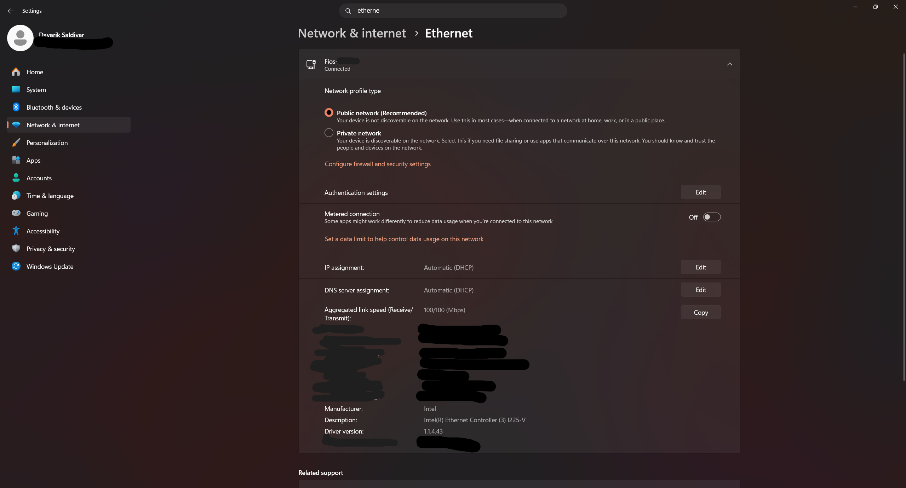
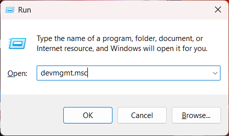
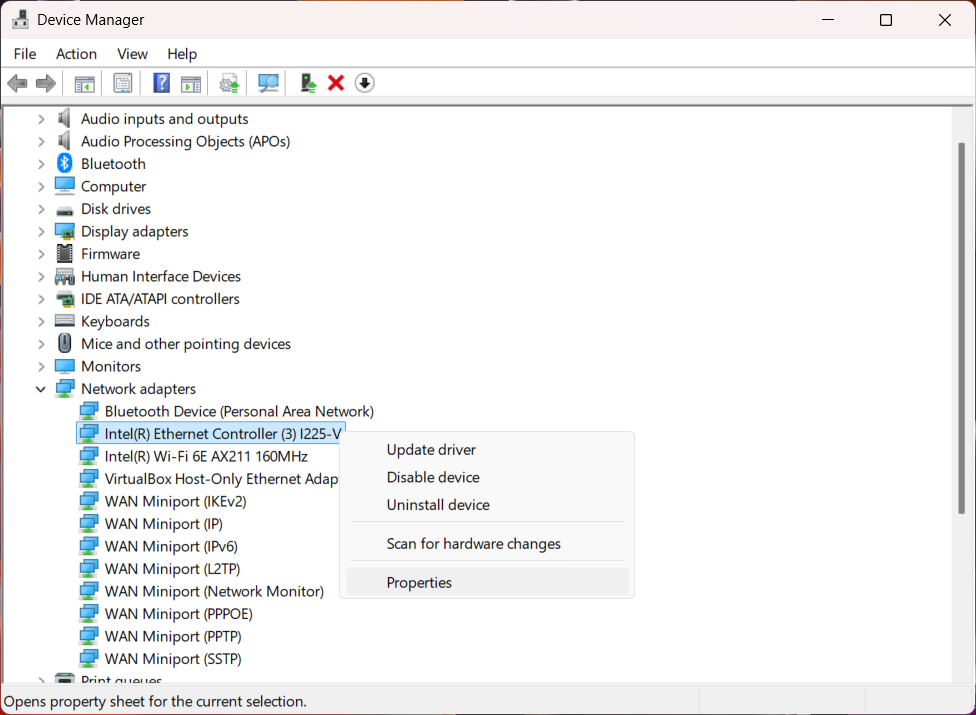
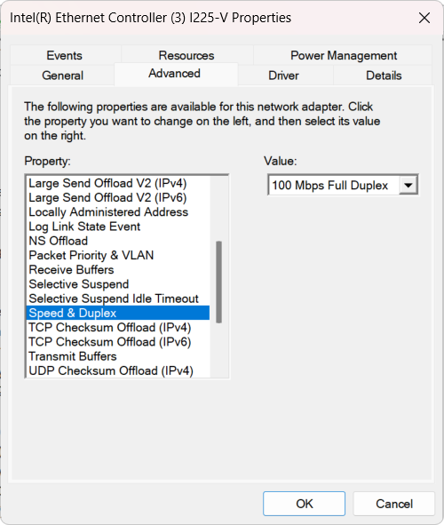
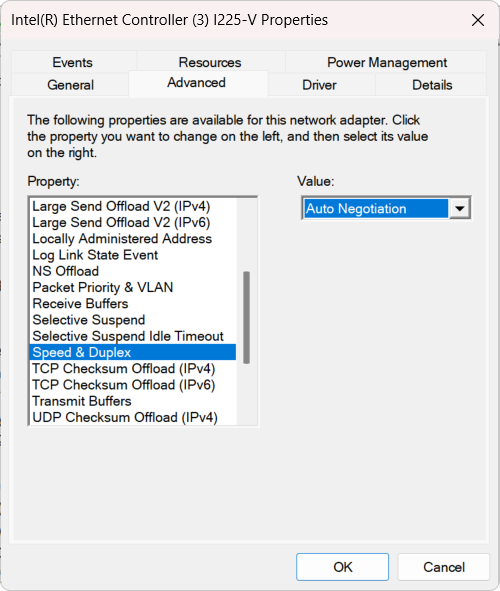
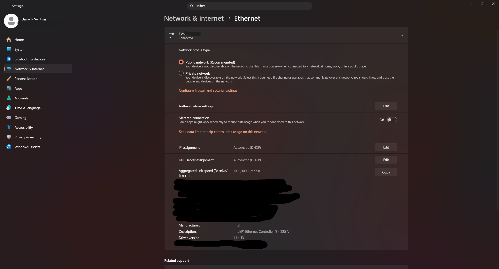
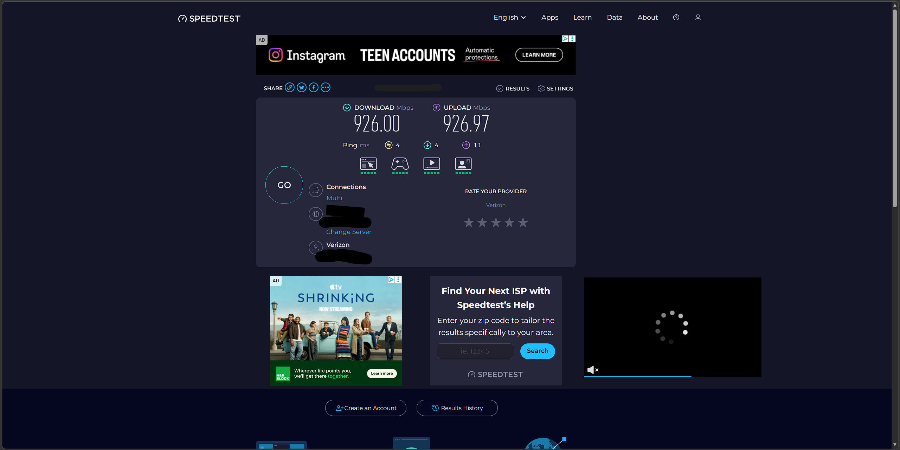

## Overview
Designed and maintained a home network supporting 30+ devices, including desktops and network-connected systems. Diagnosed and resolved a critical network performance issue, improving speeds from 100 Mbps to ~1 Gbps.

## Network Topology

## Service Provider

- ISP: Verizon FiOS

## Hardware

- ONT (ISP provided)
- Router: Verizon G1300
- Switch: Netgear GS308E (Layer 2)
- Cabling: Cat6 Ethernet
- Devices: 6 Desktop PCs, 1 Smart TV

## Network Configuration

- DHCP Enabled
- Private IP Range: 192.168.1.0/24
- Default Gateway: 192.168.1.1
- Wired Connections: 1 Gbps (Cat6 Ethernet)

## Troubleshooting

### Issue: Limited Network Speed (100 Mbps instead of 1 Gbps)

Identified a network performance issue where a desktop device was limited to 100 Mbps instead of the expected gigabit speeds, impacting overall performance.

---

### Step 1: Identified the issue in Windows settings  

---

### Step 2: Opened Device Manager using Run  

---

### Step 3: Navigated to Network Adapters  

---

### Step 4: Found incorrect Speed & Duplex setting  

---

### Step 5: Changed to Auto Negotiation  

---

### Step 6: Verified 1 Gbps link speed  

---

### Step 7: Verified with speed test (~900+ Mbps)  

### Root Cause
The network adapter's Speed & Duplex setting was set to 100 Mbps Full Duplex, which limited the link speed and did not meet expectations.

### Resolution
Changing the setting to Auto Negotiation allowed the adapter to negotiate the correct speed of 1 Gbps.

### Result
The link speed was updated to 1000/1000 Mbps, and performance was verified with a speed test (~900+ Mbps).

The importance of checking the NIC configuration settings is important when diagnosing network speed, especially if the speed does not meet expectations.

### Incident Summary (Simulated IT Ticket)

Issue: User Network speed is limited to 100 Mbps  
Cause: Incorrect NIC Speed & Duplex setting  
Resolution: Set to Auto Negotiation  
Status: Resolved

## Skills Demonstrated

- Network architecture planning
- TCP/IP fundamentals
- DHCP configuration
- Layer 2 switching
- Network troubleshooting
- NIC configuration (Speed & Duplex)
- Structured cabling
- Network documentation
